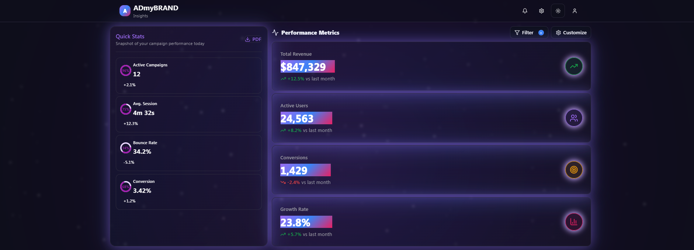
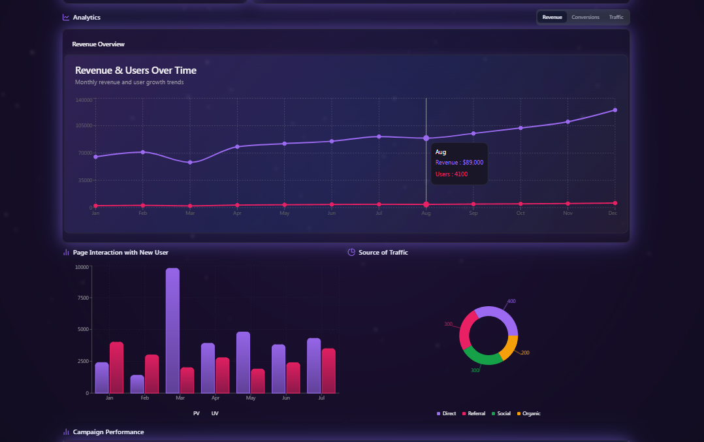
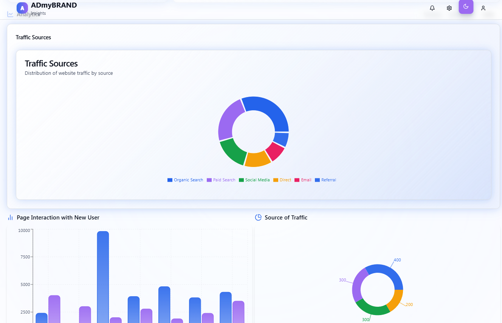
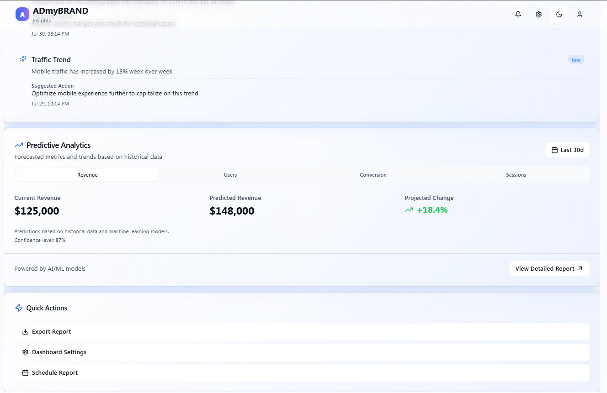

# AdMyBrand Insights 🚀

AdMyBrand Insights is an analytics dashboard designed to visualize and manage brand-related data through a customizable, Galaxy-themed interface. Built with modern web technologies, it offers a seamless and interactive user experience tailored for both aesthetics and functionality.

🌐 **Live Demo**
https://dashboard-ash-1.vercel.app/

## 🛠 Tech Stack
- React
- Tailwind CSS
- Vite
- Framer Motion (for animations and transitions)
- Skiper (for smooth UI transitions)

## 📦 Installation
To run the project locally:
```sh
git clone https://github.com/AiDoodleE/dashboard.git
cd dashboard
npm install
npm run dev
```

## ✅ Features
- Responsive dashboard layout for all screen sizes
- Light and dark mode toggle with smooth gradient transitions
- Customizable layout settings — toggle/hide dashboard elements as needed
- Galaxy-themed UI with glow effects and animated visuals
- Interactive charts showing:
  - Website traffic breakdown (direct, referral, organic)
  - Viewer classification (new vs returning vs unique visitors)
  - Engagement & conversation analytics (Facebook, Instagram, etc.)
  - Revenue and monthly growth trends
- Smooth animations powered by Framer Motion and Skiper
- Export report features for analytics

## 🚧 Future Improvements
- Replace mock data with real-time API/database integration
- Implement machine learning models to generate AI-driven insights
- Add advanced filtering and export features for analytics

## 📸 Screenshots
### Dark Mode



### Light Mode



## 🤖 AI Tools Used
- **Lovable**: Generated Galaxy-themed UI design, layout ideas, and color palettes.
- **Dribbble**: Inspiration for dashboard structure, animations, and design polish.
- **GitHub Copilot**: Helped generate base component structures and layout scaffolding.
- **Cursor IDE (60%)**: Provided real-time AI support for layout iterations and quick fixes.
- **ChatGPT**: Assisted with planning, advanced UI features, debugging, and interactivity.

## 💡 Example Prompts Used
1. “Generate a Galaxy-themed React dashboard layout Design”
2. “Create a customizable layout settings panel with toggles for sidebar, header, and background options.”
3. “Fix inconsistent sidebar toggle behavior on screen resize.”
4. “Persist layout preferences in local storage using useEffect in React.”
5. “Use gradient background and smooth fade-out effect when toggling between light and dark mode in Tailwind.”
6. “Build a responsive layout with header, collapsible sidebar, and content section using Tailwind CSS.”

## ⚖️ AI vs Manual Work Split
- **AI-generated (approx. 40%)**
  - Dashboard layout scaffolding and reusable components
  - Styling suggestions (color gradients, shadows, responsive behavior)
  - Code snippets for light/dark mode switching, transitions, and animation helpers
- **Manual coding (approx. 60%)**
  - All application logic and state management manually written, especially layout customization settings
  - Logic built independently with help of ChatGPT (for customization, settings persistence, user interaction)
  - Enhanced, optimized, and structured with Cursor IDE and ChatGPT
  - Fonts, hover states, and animations ideated from internet, implemented through prompts in ChatGPT/Copilot, and visually refined using Cursor IDE


